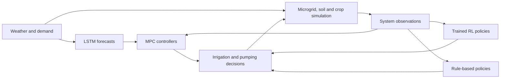
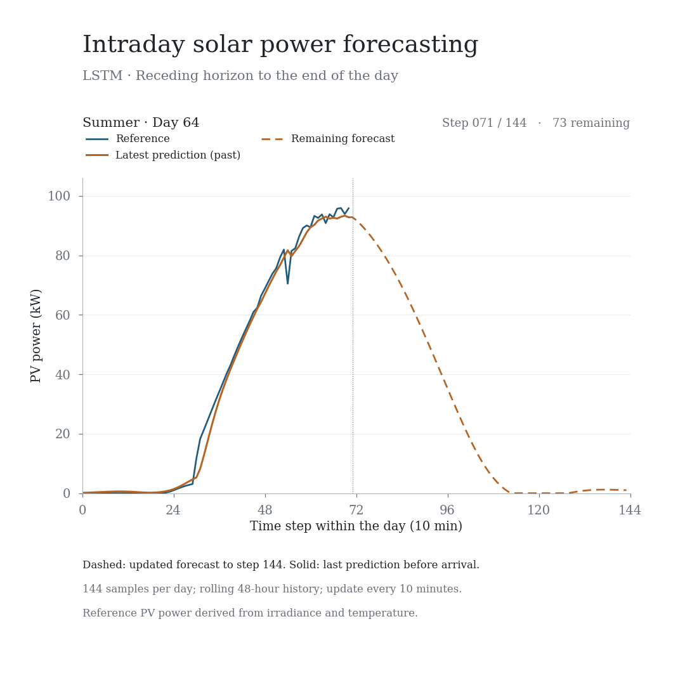

# Intelligent control of a water–energy–food microgrid

**How can irrigation, solar generation and energy storage work together?**
This research project models their interaction and compares reinforcement learning (RL), model predictive control (MPC) and rule-based operation.

Developed for the M.Sc. thesis in Electrical Engineering of **Claudio Zúñiga Bauerle**, Universidad de Chile.

## Explore the project

| I want to… | Start here |
|---|---|
| Understand and simulate the microgrid | [Simulation guide](docs/simulation.md) · [Simulation command](rl_ems/simulation/run.py) |
| Train an RL controller | [Training guide](docs/training.md) · [Training command](rl_ems/training/train.py) |
| Compare control strategies | [Comparison guide](docs/comparison.md) · [Report command](rl_ems/comparison/report.py) |
| Explore the forecasts used by MPC | [Forecasting guide](docs/forecasting.md) · [LSTM implementation](environments/utils/predict_utils.py) |
| Browse the original research experiments | [Experiment catalogue](experiments/README.md) |
| Understand data, units and limitations | [Reproducibility notes](docs/reproducibility.md) |

## The system

The daily irrigation controller sets water requirements. Every 10 minutes, the energy–water controller coordinates pumping and irrigation within a microgrid with photovoltaic generation, battery storage and electrical demand. Soil and crop dynamics close the loop.



The repository includes SAC, TD3 and PPO experiments, custom RL implementations, LSTM forecasts for PV power, electrical demand and evapotranspiration, and exploratory soil-moisture models. DQN and greenhouse code are historical components rather than the primary coupled-system workflow.

## Quick start

Use Python 3.12 and run these commands from the repository root:

```bash
git clone https://github.com/Claudio-zb/RL_EMS.git
cd RL_EMS
python3 -m venv .venv
source .venv/bin/activate
python -m pip install -r requirements.txt

# Two-day simulation with scheduled irrigation and rule-based pumping
python -m rl_ems.simulation.run --days 2

# Summarize that simulation
python -m rl_ems.comparison.report --input outputs/simulation

# Evaluate the saved PV model on a real daily window
python -m rl_ems.forecasting.predict --day 64
```

On Windows, activate with `.venv\Scripts\activate`. New simulations, reports and training runs go into `outputs/`; commands reject existing output files/directories to preserve previous runs. Choose another `--output` to repeat them. The video renderer intentionally replaces its named export.

## Solar forecasting in motion



[Watch/download the 24-second video](pv_animation/linkedin_solar_forecast.mp4).
The dashed curve is refreshed every 10 minutes through the end of the day; the solid curve preserves the last prediction made before each sample arrives.

```bash
python -m rl_ems.forecasting.animate
```

The default video covers summer days 64–66 at 1080 × 1080 and 30 fps. **The model predicts PV power in kW, not irradiance in W/m².** Reference power is calculated from irradiance and temperature for the 90 kW nominal PV model.

## Repository map

```text
rl_ems/                 Executable workflows with explicit command-line options
  simulation/           Coupled simulation and controller selection
  training/             Single-agent RL training
  comparison/           Metrics and figures from saved simulations
  forecasting/          Saved-model inference and rolling-forecast video
experiments/            Original research scripts grouped by topic
  simulation/           Standalone and coupled case studies
  training/             Historical sweeps and training figures
  comparisons/          Original controller comparisons and plots
  forecasting/          Original LSTM and soil-model experiments
environments/           Physical models, Gymnasium environments and policies
  Data/                 Existing weather, demand and model configuration data
  utils/                PV conversion, LSTM and forecast utilities
predictive_models/      Saved forecasting checkpoints and soil-model code
RL_algorithms/          Custom RL implementations used during the research
logs/                   Existing RL checkpoints and evaluation histories
simu_results/           Existing simulation outputs and research figures
docs/                   Guides, model notes and selected visual assets
outputs/                New local runs (ignored by Git)
tests/                  Focused regression and workflow checks
```

`animate_pv.py` and `predict_pv.py` remain as compatibility entry points. Other former root scripts now live in `experiments/`; see the catalogue for their new paths. Core import paths and saved checkpoint locations remain stable.

## Validation

```bash
python -m unittest discover -s tests -v
```

These checks exercise the forecast horizon, controller construction, short simulation and reporting semantics. They do not establish that a retrained agent reproduces the original research results. See [reproducibility](docs/reproducibility.md) for the distinction between historical experiments and the new entry points.

## Related publication

**A novel sustainable approach of reinforcement learning control for a water-energy-food microgrid** — IEEE Latin American Conference on Computational Intelligence, 2025.

## Author

**Claudio Zúñiga Bauerle** · Electrical Engineer and M.Sc. in Electrical Engineering, Universidad de Chile.

[LinkedIn](https://www.linkedin.com/in/claudio-z%C3%BA%C3%B1iga-bauerle-63303a220) · claudio.zuniga.b@ug.uchile.cl

This work was developed with contributions from the associated research team and academic supervisors.
